## How to Order

You can order a product by sending me a list of SKUs and quantities. Below is the full SKU map.
- Postfix your resulting SKU with the version. This ensures that I'll make compatible components. The current release is always available at [github.com/reid23/yet-another-pompfen-store/releases/latest](https://github.com/reid23/yet-another-pompfen-store/releases/latest).
  - ex: if you order a wide shortstaff guard with cover for version 0.2.1, your final SKU would be `F-GU-SS-COV-v0.2.1`.
- `XXXX` is the cover & foam color options, which are listed [below](#cover--color-options).
- `[SH|LO|QT|ST|SS]` are weapon types. They correspond to short, long, q-tip, staff, and shortstaff, respectively.
- All staff guards will be opaque black for now. If you really want something different let me know, but I don't see a ton of demand for this.

> [!NOTE]
> **UPDATE** I made a little website to help configure this! Go to [reid.xz.ax/yaps](https://reid.xz.ax/yaps) to configure everything and get the price & SKU.
> **please still read this file**, since it contains important information and suggestions.

### 1. Full Weapon (`W`)

`CP` ("core provided") is if you'll give me a core or ordered one in the core order and want me to use it. `NC` ("no core provided") is if you want me to provide the core.  

`PO` means "pommel"; `NP` means "no pommel". choose the latter if you want to make your own. You'll need to cut the end of the core to length based on how thick your pommel will be.  

The format is `W-[CP|NC]-[SH|LO|QT|ST[W|N]|SS[W|N]]-[PO|NP]-XXXX`:
- Short: `W-[CP|NC]-SH-[PO|NP]-XXXX`
- Long: `W-[CP|NC]-LO-[PO|NP]-XXXX`
- Q-tip: `W-[CP|NC]-QT-XXXX`
- staff: `W-[CP|NC]-[ST|SS]-[W|N]-[PO|NP]-XXXX`
  - `ST` is full staff, `SS` is shortstaff
  - `W` is wide guard (3"), `N` is narrow guard (2.25")

### 2. Foam (`F`)

This is where you can get blades and guards separately if you want.

Use `COV` if you want a cover or `NC` if you don't (ie, if you're replacing an old bit of foam but the old cover is still fine).

**Important**: if you are reusing a cover, make sure the foam color you request is the same as the one you originally had! Each color of noodle has a slightly different diameter, so the covers are noodle-color-specific.

- Long/Staff (`F-LO-[COV|NC]-XXXX`)
- Short (`F-SH-[COV|NC]-XXXX`)
- Q (`F-QT-[COV|NC]-XXXX`) (only a single blade!)
- Staff Guard (`F-GU-[ST|SS][W|N]-[COV|NC]`) (does not include grip!)
  - `ST` for full staff, `SS` for shortstaff
  - `W` for wide (3"), `N` for narrow (2.25")

### 3. Core (`C`)

Complete cores are cut to length for a weapon and contain all hardware needed for that weapon preinstalled.

The "raw cores" are just what you get from the core order, but immediately! If you need a core now, you can get one, but otherwise i'd recommend waiting for the next core order to get a lower price. These have the 'Reid maintains inventory, fronts cost, and stores cores in his house' fee added.

- Complete (`C-CMP-[SH|LO|QT|ST|SS]`)
- Raw (`C-RAW-[LO|2SH|QT]`)
  - `LO` is 1.35m, for longsword
  - `2SH` is 1.6m, for two shorts.
  - `QT` is 1.9m, for a Q, staff, or shortstaff.

### 4. Parts (`P`)
- Pommel (`P-PO`)
- Blade Hardware Kit (`P-BHK`)
- Staff Guard Hardware (`P-SGH`)
- Staff Grip (`P-SGR-[W|N]`)
  - `W` for wide (3") and `N` for narrow (2.25")

## Pricing

Full weapon costs are the sum of the complete core, foam assemblies, pommel, and grip costs. If you provide a core, there is no core cost, but the appropriate mouting hardware kit costs are added.

Foam Assemblies (Blades/Guards):
- Short: $30 ($21 without cover)
- Long: $40 ($29 without cover)
- Qtip: $28/side ($19 without cover)
- Staff/Shortstaff Guard: $20 ($13 without cover)

Complete Cores (with hardware):
- Short: $22
- Long: $32
- Staff & Shortstaff: $45
- Qtip: $46

Raw Cores:
- 1.35m (long): $30.00
- 1.6m (2 shorts): $38.40
- 1.9m (q, staff): $42.50

Mounting hardware kits: 
- $2 per blade
- $1.5 per staff guard

Pommel: $2
Staff grip: $5

A few comments:
- If you have an existing core, I would highly recommend getting a hardware kit and installing it yourself instead of buying a new core. It will cut cost significantly, and the process is very easy. You need superglue, a tape measure, a lighter or heat gun, and some tape (preferrably athletic tape, but any should do).
- If you're replacing an old blade, if the cover is still in good shape, buy a blade without the cover! It's much less labor for me and thus much cheaper for you.
- No tape is applied to the handles by default. If you want it, you need to add it yourself. Everyone has a different opinion on how this should be done, so I'm just going to leave it up to you.

## Cover & Color Options

There are two cover material options:

| Property                 | 1.1oz Silnylon Ripstop       | 1.0 oz MONOLITE Ripstop Nylon Mesh |
| :----------------------- | :--------------------------- | :--------------------------------- |
| **General**              |                              |                                    |
| Waterproof               | Yes                          | No                                 |
| Opaque                   | dark colors yes, light are more translucent  | No                      |
| **Dimensions**           |                              |                                    |
| Weight                   | 1.1 oz                       | 1.0 oz                             |
| Thickness                | 2.4 thou                     | 3.9 thou                           |
| Thread Count (warp/weft) | 200 / 180 per inch           | 178 / 178 per inch                 |
| **Strength (warp/weft)** |                              |                                    |
| Tear Strength            | 13.4 / 10.1 lbf              | 1.6 / 3.0 lbf                      |
| Tensile Strength         | 18.9 / 16.2 lbf              | 22.3 / 24.8 lbf                    |

You can see a visual comparison of the two [here](https://www.youtube.com/watch?v=gX634O65S6A). Ignore the first fabric. the second looks like the opaque silnylon but is much weaker because it lacks the silicone coating. the third fabric is the mesh.

There's also Silpoly which looks to have the right specs and has some more colors, but I have not experimented with it yet, so I won't claim that it works well. You can take a look yourself though: https://ripstopbytheroll.com/products/1-1-oz-silpoly

To be entirely honest, the technical details are mostly irrelevant. Both options are similarly strong and robust, and weight basically the same. If anything, the mesh is likely a tiny bit tougher, but rips propagate slightly easier.

I maintain inventory with proper safety stock of black for both of these fabrics. If you want a different color, there will be a $5 additional charge for each new color you'd like (ie, if you order five bright pink pompf it'll still only be $5 extra).

If you would like me to make a cover from a custom fabric, I can do that! Just contact me directly.

The noodle underneath the cover comes in three colors: red, blue, and yellow. They look like this: 

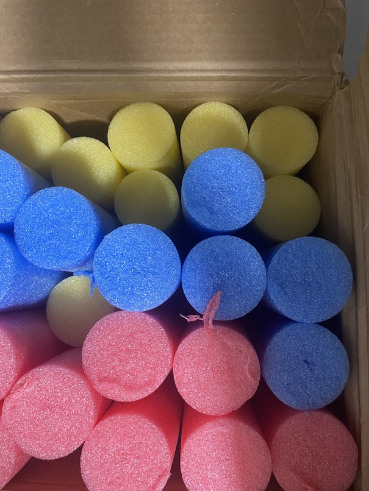

If you go with the opaque Silnylon cover (ie, one of the darker colors of silnylon), you'll basically never see this. At most, it's a tiny accent at the edge of the blade (on everything except qtip, where it isn't visible at all). If you go with the mesh, you can see the color through the cover.

Please let me know what color noodle you'd like by appending an `R`, `B`, `Y`, (red, blue, yellow) or `X` (no preference) to the end of the three-letter ripstop color SKU (see below) you tell me.

The color options in fabrics I've tested are below. Please tell me the SKU of the one you want.

| in stock? | extra fee? | SKU | human readable name  | image |
| --- | --- | --- | -------------------- | ----- |
| yes | NO  | PBR | pure black           | 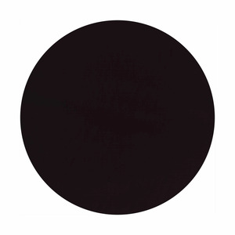 |
| yes | NO  | PBM | pure black mesh      | 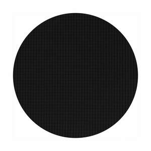 |
| yes | yes | FGR | foliage green        | 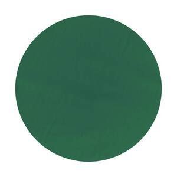 |
| yes | yes | RPM | royal purple mesh    | 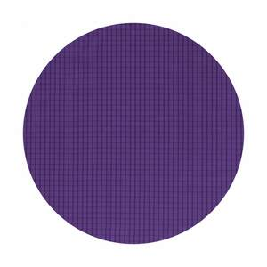 |
| yes | yes | GTR | green tea            | 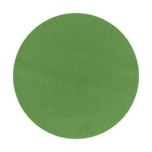 |
| yes | yes | RER | robin egg blue       | 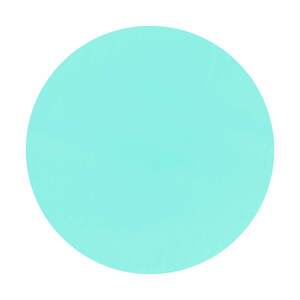 |
| yes | yes | ODM | olive drab mesh      | 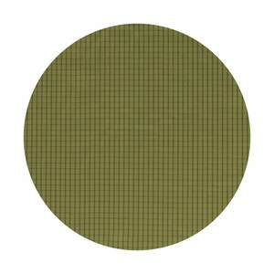 |
| NO  | yes | RPR | royal purple         | 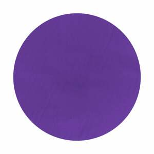 |
| yes | yes | DOR | dark olive           | 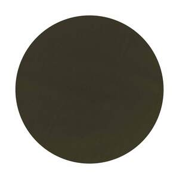 |
| yes | yes | RTR | real teal            | 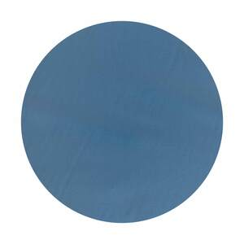 |
| yes | yes | ORM | blaze orange mesh    |  |
| yes | yes | BOR | blaze orange         | 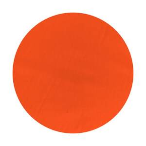 |
| yes | yes | HPR | hot pink             | 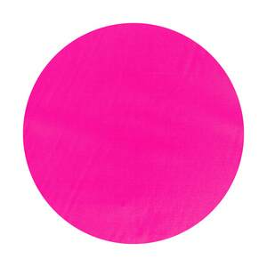 |
| yes | yes | ODR | olive drab           | 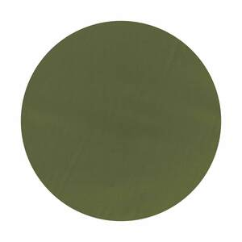 |
| yes | yes | PWR | plain white          | 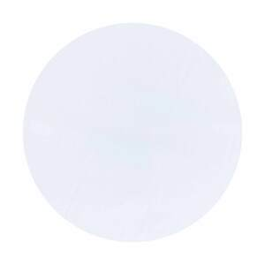 |
| NO  | yes | CGR | charcoal gray        | 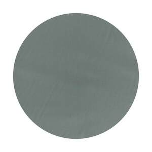 |
| yes | yes | DOM | dark olive mesh      | 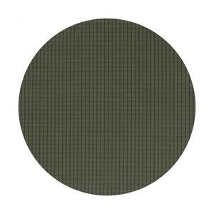 |
| yes | yes | MBM | moroccan blue mesh   | 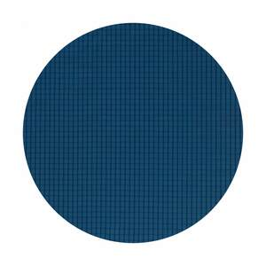 |
| yes | yes | BOM | burnt orange mesh    | 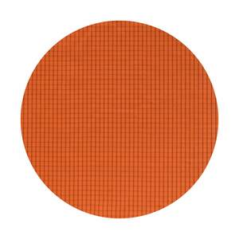 |
| yes | yes | HGM | hunter green mesh    | 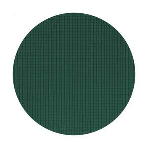 |
| yes | yes | WMR | white mesh           |  |
| yes | yes | CBR | coyote brown         | 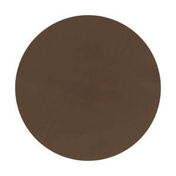 |
| yes | yes | BYR | blaze yellow         | 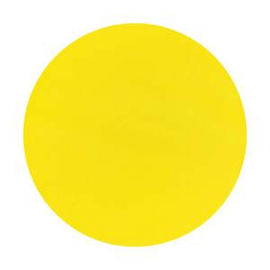 |
| yes | yes | CGM | charcoal gray mesh   | 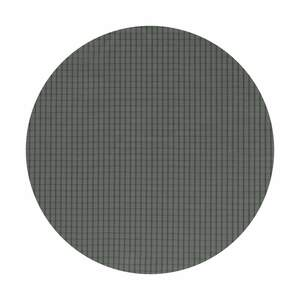 |