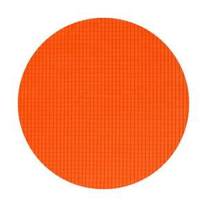

So I spent like 4 hours one day writing down everything I could into this nice order form. There was a whole SKU system and everything was organized. You'd put together all the options you want and then say "I want 2pc SLBYXPFGRP" and i'd be like "ok coming right up".
Then, I did `git commit` so that nothing would get lost. I did not, however, `git push`, since i didn't want to make the order form public just yet.
Then while I was waiting to do that, I accidentally `rm -r ~/Documents/codeprojects`, where this repo lives.

I no longer have a fully built-out order system. This document will be enough for now.

## Pricing

Foam Assemblies (Blades/Guards):
- Short: $30 ($21 without cover)
- Long: $40 ($29 without cover)
- Qtip: $28/side ($19 without cover)
- Staff Guard: $25 ($16 without cover)

Cores (with hardware):
- Short: $22
- Long: $32
- Staff & Shortstaff: $45
- Qtip: $46

Mounting hardware kits: 
- $3 per blade
- $2 per staff guard

Pommel: $2

Raw Cores:
- 1.35m (long): $30.00
- 1.6m (2 shorts): $38.40
- 1.9m (q, staff): $42.50

A few comments:
- If you have an existing core, I would highly recommend getting a hardware kit and installing it yourself instead of buying a new core. It will cut cost significantly, and the process is very easy. You need superglue, a tape measure, a lighter or heat gun, and some tape (preferrably athletic tape, but any should do).
- If you're replacing an old blade, if the cover is still in good shape, buy a blade without the cover! It's much less labor for me and thus much cheaper for you.
- Pommels are a separate additional cost because everyone has their own preferences on pommels so if you don't like mine you can make your own instead.
- No tape is applied to the grips by default. If you want it, you need to add it yourself. Everyone has a different opinion on how this should be done, so I'm just going to leave it up to you.
- The "raw cores" are just what you get from the core order, but immediately! If you need a core now, you can get one, but otherwise i'd recommend waiting for the next core order to get a lower price (these have the 'Reid maintains inventory, fronts cost, and stores cores in his house' fee added).

## Guard Options
Staff guards can be wide (3" diameter) or narrow (2.25" diameter).
They can be long (350mm) or short (300mm).

## Cover & Color Options

There are two cover material options:

| Property                 | 1.1oz Silnylon Ripstop       | 1.0 oz MONOLITE Ripstop Nylon Mesh |
| :----------------------- | :--------------------------- | :--------------------------------- |
| **General**              |                              |                                    |
| Waterproof               | Yes                          | No                                 |
| Opaque                   | Yes                          | No                                 |
| **Dimensions**           |                              |                                    |
| Weight                   | 1.1 oz                       | 1.0 oz                             |
| Thickness                | 2.4 thou                     | 3.9 thou                           |
| Thread Count (warp/weft) | 200 / 180 per inch           | 178 / 178 per inch                 |
| **Strength (warp/weft)** |                              |                                    |
| Tear Strength            | 13.4 / 10.1 lbf              | 1.6 / 3.0 lbf                      |
| Tensile Strength         | 18.9 / 16.2 lbf              | 22.3 / 24.8 lbf                    |

You can see a visual comparison of the two [here](https://www.youtube.com/watch?v=gX634O65S6A). Ignore the first fabric. the second looks like the opaque silnylon but is much weaker because it lacks the silicone coating. the third fabric is the mesh.

There's also Silpoly which looks to have the right specs and has some more colors, but I have not experimented with it yet, so I won't claim that it works well. You can take a look yourself though: https://ripstopbytheroll.com/products/1-1-oz-silpoly

To be entirely honest, the technical details are mostly irrelevant. Both options are similarly strong and robust, and weight basically the same. If anything, the mesh is likely a tiny bit tougher, but rips propagate slightly easier.

I maintain inventory with proper safety stock of black for both of these fabrics. If you want a different color, there will be a $5 additional charge for each new color you'd like (ie, if you order five bright pink pompf it'll still only be $5 extra).

If you would like me to make a cover from a custom fabric, I can do that! Just contact me directly.

The noodle underneath the cover comes in three colors: red, blue, and yellow. They look like this: 

If you go with the opaque Silnylon cover, you'll basically never see this. At most, it's a tiny accent at the edge of the blade (on everything except qtip, where it isn't visible at all). If you go with the mesh, you can see the color through the cover.

Please let me know what color noodle you'd like by appending an `R`, `B`, `Y`, (red, blue, yellow) or `X` (no preference) to the end of the three-letter ripstop color SKU (see below) you tell me.

The color options in fabrics I've tested are below. Please tell me the SKU of the one you want.

| in stock? | extra fee? | SKU | human readable name  | image |
| --- | -- | --- | -------------------- | ----- |
| yes | yes | FGR | foliage green        |  |
| yes | yes | RPM | royal purple mesh    |  |
| yes | yes | GTR | green tea            |  |
| yes | yes | RER | robin egg blue       |  |
| yes | yes | ODM | olive drab mesh      |  |
| NO  | yes | RPR | royal purple         |  |
| yes | yes | DOR | dark olive           |  |
| yes | yes | RTR | real teal            |  |
| yes | NO  | BMR | black mesh           |  |
| yes | yes | BOM | blaze orange mesh    |  |
| yes | yes | BOR | blaze orange         |  |
| yes | yes | HPR | hot pink             |  |
| yes | yes | ODR | olive drab           |  |
| yes | yes | PWR | plain white          |  |
| NO  | yes | CGR | charcoal gray        |  |
| yes | yes | DOM | dark olive mesh      |  |
| yes | yes | MBM | moroccan blue mesh   |  |
| yes | yes | BOM | burnt orange mesh    |  |
| yes | NO  | PBR | pure black           |  |
| yes | yes | HGM | hunter green mesh    |  |
| yes | yes | WMR | white mesh           |  |
| yes | yes | CBR | coyote brown         |  |
| yes | yes | BYR | blaze yellow         |  |
| yes | yes | CGM | charcoal gray mesh   |  |