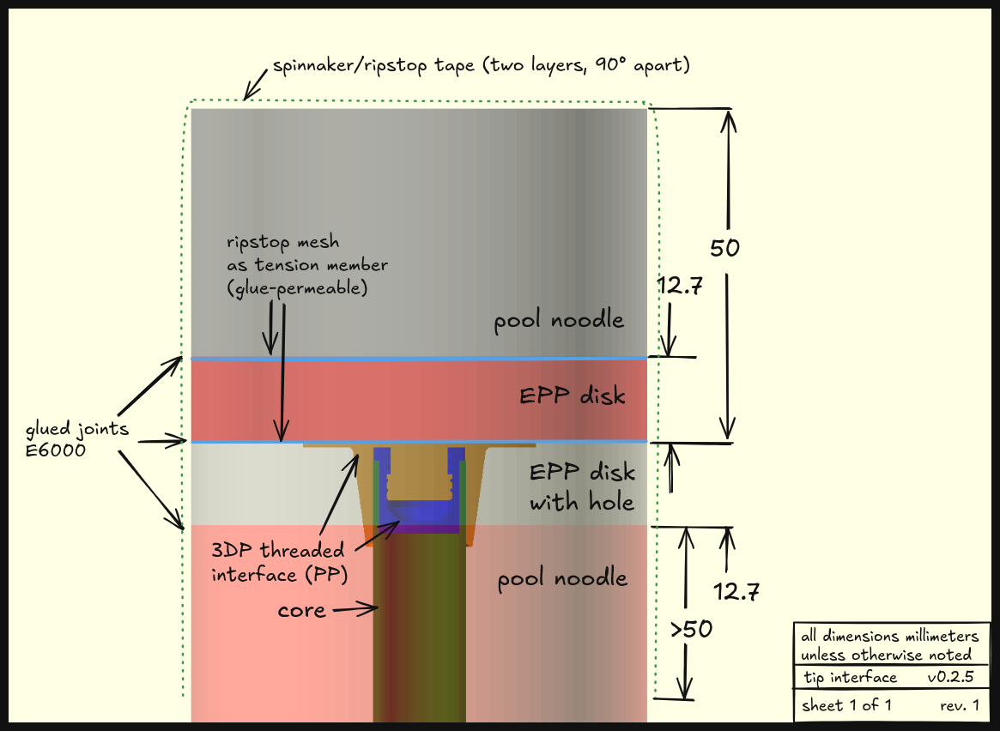

# Building Your Own

My intent is to sell these, but that doesn't mean you can't make your
own! I caution that these were designed to be easy to make at a
larger scale, so the time and material cost may be much higher for
you.

> [!IMPORTANT] Please read this entire document before deciding to
> build your own. If you get halfway through and realize that this is
> too complicated or requires tools you don't have, it will not be
> very fun.

## 3D printed parts

There are rigid and flexible parts. I recommend printing the rigid
parts in polypropylene, because it is very lightweight, very
isotropic, quite soft, and yields and necks before breaking (instead
of just shattering like PLA). I'd highly recommend getting some
Magigoo PP to help with bed adhesion; PP is very hard to stick to
anything.  The flexible parts are less material dependent. The
provided slicing settings assume a shore hardness of ~83A, though 85A
probably will work too.

Use the `flexibles.3mf` and `pp_all.3mf` files from the `slice`
folder. They were exported with PrusaSlicer; I'm not sure how well
that plays with other slicers. Hide/show and duplicate components
based on what you need.

## Foam

There are three types of foam:
- solid core noodle, for the blade
- 1/2", 1.3lb/cubic foot EPP sheet
- 3"x1" pipe insulation or 2.25" hollow noodle for the guard
  (depending on how big you want your guard)

### Solid Core Noodle

For the solid core noodle, for each blade, you'll need:
- one tip, which is just a 37.3mm thick piece of solid noodle
- one blade, a piece of cored solid noodle of the length specified in the table below.

> [!IMPORTANT] 
> 
> As of v0.3.0, the heat shrink reinforcement of the internal diameter
> is **required**. It ensures that there is no axial stretching, which
> is needed in place of the tip thread.

| pompf | nominal blade length | recommended cut length |
|-------|----------------------|------------------------|
| long  | 821.9                | 830                    |
| short | 571.9                | 580                    |
| qtip  | 511.9                | 520                    |

This produces a blade that is one centimeter oversized for longs and
qtips and a blade that is precisely correctly sized for qtips. This is
because the active constraint on blade length for qtips is a maximum,
while for the others, it is a minimium. The extra length added to get
the recommended cut length is to add preload during the glueup; the
final blade length will be the correct nominal length.

To create the cored noodle, you need to cut a hole of the appropriate
size down the center of the solid core noodle. I have a jig for that
[here](https://www.printables.com/model/1233976-pompf-coring-jig/files). You
heat up the brass tube with a heat gun (don't use a flame; it makes
the foam stick to the tube) and push it through the noodle.

#### ID Reinforcement

To reinforce the internal diameter of the foam and prevent it from
cracking, we create a tube out of heat shrink film tubing and glue the
blade to it. I use Uline `S-23533` tubing.

First, prepare a mandrel. This may take a bit.

1. Take a spare core and glue on a cap (like
`build/components/tip_cap.stl`).
2. Apply a single layer of clear tape to the core, ensuring everything
   is perfectly smooth and there are no bubbles. The tape should be
   aligned axially (the long way, not in short little loops) and
   should start 3cm from the tip with the cap and extend down at least
   5cm longer than the blade you are trying to make.

Then, cut an oversize length of heat shrink tubing, put it over the
mandrel, and shrink it with a heat gun. Ensure that:

- it does not have any wringles oriented perpendicular to the core;
axially aligned wrinkles should be avoided if possible but are
okay.[^1]
- there is at least a little bit of heat shrink extending past the tip
  of the core to prevent the tube from sliding down the core if it
  were pulled
- the section of tubing above the core pinches all the way closed (you
  can help it by twisting it while it's heated) 

Finally, trim the section of the tubing that is above the core so it's
just long enough to pinch closed all the way and isn't sticking out
too much past the diameter of the core. Then once the tubing is cool,
remove it from the mandrel.

### EPP

For the EPP sheet, you'll need to cut circles. I do this by strapping
a hot knife foam cutter to my 3D printer and running the gcodes in the
`build` folder. Workholding is done by double-sided taping EPP
rectangles to the `epp_support_[type]` part. If those parts are too
big for your printer, you can set the `nrows` and `ncols` parameters
by editing the `// @build` comments (see [the build system
docs](code.md#build-system) for more info on how this works) above the
`epp_support` module and then rebuilding.

There are pre-generated gcode files for this in the `build/gcode`
folder. Each blade requires 4 pieces of EPP; two on the tip side and
two on the hand side. Each guard requires two
pieces. `blade_hand.gcode` and `blade_tip.gcode` each cut three pairs
of EPP pieces for their respective sides of the
blade. `narrow_guards.gcode` and `wide_guards.gcode` each cut three
pairs of EPP (enough for three guards) each.

Before you run those, though, you may need to tune the kerf of your
hot knife. Cut through the foam at 100mm/min and measure the kerf in
millimeters. Divide that by two to get the radius of the cut.

First, update the `epp_support`. Pass `$kerf=<your_kerf_radius>` in
the `// @build` comments above the `epp_support` module and then
rebuild.  Then, from the root directory of this repo, run:

```bash
python epp_cam.py --kerf your_kerf_radius_here
```

This will generate new gcode files that will cut the shapes accurately
for you.

Be sure to do these in this order, since rebuilding with `./buildall`
overwrites the results of running `epp_cam.py`.

If you want to cut many pieces of EPP at once, you can use the
`-z`/`--zclear` parameters to set the travel height. For more
information on the arguments to `epp_cam.py`, use the standard help
flag:

```bash
python epp_cam.py --help
```

### Staff Guard

There isn't much to this one. Just take your selected material and cut
it to length. For a full length staff, that's 412.6mm, and 100mm less
for a shortstaff.

## Covers

I'd save the covers for last, after you've assembled everything. That
way it's easier to test the fit. The dimensions of the cover change
based on the precise diameter of your noodle, so you'll have to tune
it at least once for each cover type you make.

For blade covers, the procedure is:
1. cut a rectangle big enough for the cover
2. hem one short side to create a loop for the wire to go through
3. fold it in half the long way and pin/tape it somehow, making sure
   the hem on the side is on the outside
4. mark the distance from the folded edge that you plan to sew.
5. sew it! I use a Serger style machine for this part because it's
   fast and I have access to one, but if you don't, a normal machine
   works fine. Just be sure to add multiple stitches so it doesn't
   fray and fall apart super fast.
6. test fit on your stick and measure & mark where you want to sew
   across the top
7. turn it back inside out and sew a straight line across the top
8. sew the two corners together and trim any excess fabric
9. use a lighter to clean up any wispies and seal in the edges of the
   ripstop, especially around the hem you made in step 2.
10. Cut a small hole in the loop of the hem where you can insert the wire.

For guard covers, the procedure is the exact same, except that you
should hem both short sides and you don't need to close off the tip.


## Assembly

### Cores

Cut the cores to the appropriate length. The measurements I use are:
- short: 838mm
- long: 1388mm
- Staff: 1788mm (100-150mm shorter for shortstaff)
- Qtip: 1896mm

In reality you often want to cut them a little shorter to make sure
you're safely within the legal length. How much you take off is up to
you.

Then, measure out where the hardware is supposed to go on the core,
ensuring you have the clearances in the right direction to be
legal. (I'll write up measurements with clearance directions specified
here eventually but I believe in you to figure it out).  Then,
everywhere you have to attach a (non-removable) printed part, sand the
core a little bit to scratch the surface, clean it, and then superglue
the part on. Try to put a little glue on the edges of the part as well
to provide a more mechanical means of locking the part in place.

For `blade_m`, make sure the (more) blank part is on the hand side of the
blade. Apply some adhesive heat shrink tubing (the kind for
electronics) over the blank part to help hold it in place.

For staffs, use small bits of heat shrink to create stops on the core
to hold the four `staff_guard_spacer`s in place.

### Blades

#### Tip Assembly

The final tip assembly should look like this:


(yes the printed parts are slightly different; don't worry about it)

To build this:

1. cut the tip pool noodle to length and cut out the EPP disks
2. cut out two bits of ripstop mesh larger than the diameter of the tip
3. apply glue around the entire outside of `tip_flange` and push it into the
   disk that has a hole.
4. apply glue all over one side of the solid EPP disk and push it onto
   the flange side of the existing assembly with one piece of ripstop
   mesh between them
5. do the same thing for the other side of the solid EPP disk: apply
   glue, apply ripstop, and press the tip noodle on.
6. clamp it together! To ensure everything is clamped properly, put
   another piece of EPP with a hole in it on the bottom side,
   protected by a piece of wax paper with a hole just large enough for
   the `tip_flange`'s extending tube part to pass through.

Leave this clamped to cure for at least 24 hours.

#### Hand Side Assembly

The hand side assembly is simpler so I don't have a diagram. 

1. Apply glue all around the outside of the `blade_f` and insert it into the EPP disk with the larger hole
2. Apply glue evenly around the flanged side of the assembly and press the other EPP disk on
3. Place this assembly on a core (to ensure all the holes stay aligned) and clamp it together.

Leave this clamped to cure for at least 24 hours.

#### Gluing!

This is the *final glueup of the entire process*. You should have both
EPP assemblies ready and a core with all necessary hardware installed
before beginning.

Just like with the EPP assemblies, I've used E6000 and seen good
results, but I'm sure there's plenty of other adhesives that would
work okay.

First, place the hand side EPP assembly on the core and secure it with
the collet.  Then, place the tube on the core and trim the bottom
until it is the right length to seat against the printed part inside
the EPP assembly and on the tip at the same time. This means that the
tube should go *inside* one of the two slices of EPP. It is vital
that you cut the tube to the right length to **within +0/-5mm**.

Once it is cut to the right length, apply glue to the very bottom of
the tube and slide it all the way onto the core. This should glue the
tube to the internal face of one slice of the hand side EPP assembly.

Next, apply glue in two places:
1. around the tube, ensuring even glue distribution around the radius
   (even distribution along the core doesn't matter). This is the glue
   that will end up holding the bottom half of the blade to the tube.
2. inside the cored noodle, from both sides, but mostly from the side
   you're going to put the core into. This is the glue that will end
   up holding the top half of the blade to the tube.
   
Then, gently push the cored noodle onto the core around the tube. Glue
will gradually get sucked into the joint on both sides. If either side
seems to run out, replenish it.

When you are nearing the end, apply glue to the entire face of the
hand side EPP assembly to glue it to the noodle. Pulling on only the
bottom half of the noodle (the hand side half), close the gap just barely.

Then, on the tip side, keep pushing the noodle down until there is up
to 5-10mm of exposed core and tube. Then:
1. cover that section of tube as well as the top face of the noodle in
   glue.
2. cut off the very top of the tubing so that it does not extend
   higher than the top of the core cap. You can use a knife to cut
   around the circle. Be careful not to get any glue above the cut.
3. Put the tip on, being careful not to crease the tube at all. Ensure
   the tip goes *all the way on*.

#### Taping

> [!IMPORTANT]
> **On the Use of Tape**  
> To ensure the strength and longevity of taped joints, make sure that you:
> - minimize touching the adhesive with anything
> - minimize the amount of dust in the air (ie, don't do this in a woodshop)
> - apply firm pressure on every piece of tape to ensure the adhesive 
>   activates and forms a good bond
> - ensure target surfaces are clean, especially from any sorts of oils.
> - ensure that tape is loaded fairly evenly across its width, especially
>   since both athletic and spinnaker tape do not provide much shear strength.
> - minimize any wrinkles and sharp exposed tape corners; these are things
>   that can catch on things and reduce effective adhesive area.

Now, taping!  It's rather hard to clamp this glueup, so instead we
tape it. Cut two pieces of spinnaker tape, each 250-300mm long. Apply
them over the top of the tip at a right angle to each other, ensuring
there is significant preload holding the tip down and pulling the
blade foam up.

Then, repeat the same procedure for the hand side. You will need to
cut a circular hole in the middle of the tape to make room for the
collet. If you're building a Q-tip, I recommend doing each side
separately so that you can still put the tape over the opposite end of
the core. Likewise, don't put a pommel or staff guard on the end of
the core so that you can put this tape on.[^2]

#### Curing

Wait at least 24 hours for everything to cure before even thinking
about removing it from the core.

### Staff Guards

First, assemble one `guard_epp` and the `guard_thread_f`:
1. put them together
2. wrap them in two loops of athletic tape, the second loop
   perpendicular to the first.
3. use flush cutters to cut holes in the tape, with the same caution
   as for `blade_epp` and `blade_f`. Particularly ensure that on the
   flange side, the tape does not hang over the hole at all.

Now, put the `guard_epp` and `guard_thread_f` assembly on the guard
foam (the insulation or hollow noodle). Make sure the flange of
`guard_thread_f` is sandwiched between the EPP and guard foam. Use a
hoop of athletic tape to attach the two.

Then, use another loop of athletic tape to attach the second
`guard_epp` to the other end of the guard foam.

Finally, put the guard cover over the guard and use one piece of wire
on each side to affix it.

### Final Assembly

First, put the pommel on, if the stick you're building has one. Secure
it with two pieces of heat shrink: one just over the small shoulder of
the pommel and another on top of that, extending further up onto the
pommel.

Then, if you're building a staff:

1. put the four `staff_guard_spacer`s on between the heat shrink collars. 
2. put the guard foam on and thread it down until it is
   tightened. Don't put more than like 0.5 Nm into tightening it.
3. put the `staff_spacer` over the core in front of the guard foam.
4. put the `staff_grip` over the spacer.


[^1]: this is because we rely on this tube for some axial strength
    during installation, so horizontal wrinkles essentially pre-buckle
    it for us and can cause installation issues.

[^2]: lwk this is bad form because I should warn about this
    beforehand, but if you got this far without reading the entire
    document first, maybe this will serve as a good lesson.
